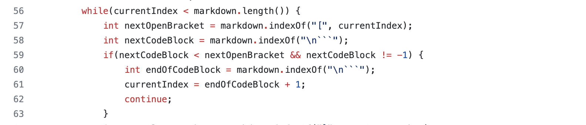
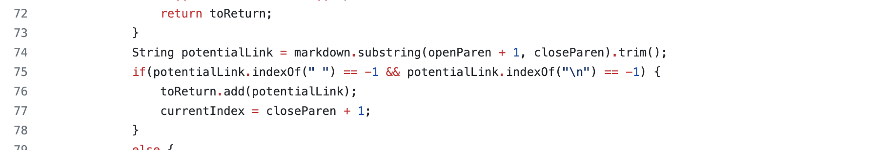

# Lab Report 5

I first copied the script and text-file into my directory: 

And this is the implementation I have right now: 

## test file 483
### My: 

### Class File: 

I found this difference manually and I am not sure who is right because I am not sure if web links are allowed start with weird symbols like ./ 

Since it is probably not allowed to behave like that, the instructor's code is corrent and I should include the below code in my code to check for the correctness of the links: 

## test file 41
### My:

### Class File: 

I also found this difference manually and I think I am wrong because this is not a valid link at all. I do not think links are suppose to have space between the symbols or characters.   

Below is the code from the instructors that I think my code should also include to check the spaces between the links:  (Line 75)

