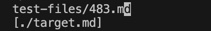

# Lab Report 5

I first copied the script and text-file into my directory: 

And this is the implementation I have right now: 

## test file 483
### My: 

### Class File: 

I found this difference manually and I am not sure who is right because I do not think web links should start with weird symbols like ./ So the markdownparse.java might should check if there is weird symbols in the beginning of the link first. 

## test file 41
### My:

### Class File: 

I also found this difference manually and I think I am wrong because this is not a valid link at all. I think one solution for this is to check if the elements such as //, ; which are symbols necessary for a website link exist. 

